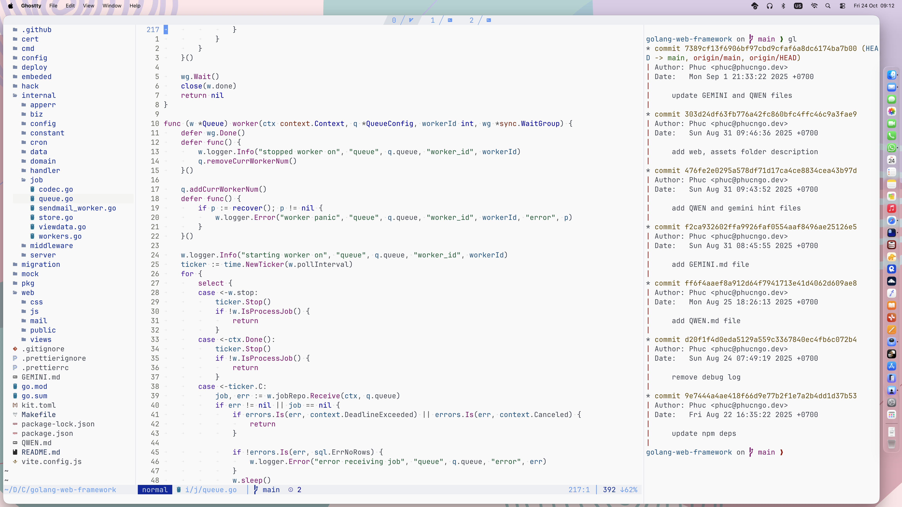

# Modus Themes

[](https://github.com/miikanissi/modus-themes.nvim/releases/latest)
[](https://github.com/miikanissi/modus-themes.nvim/actions/workflows/ci.yml)
[](https://github.com/miikanissi/modus-themes.nvim/blob/master/LICENSE)
[](https://www.w3.org/WAI/WCAG21/Understanding/contrast-enhanced.html)

Highly accessible themes for [Vim](https://github.com/vim/vim) 8 and above, conforming with
the highest standard for color contrast between background and foreground values
([WCAG AAA](https://www.w3.org/WAI/WCAG21/Understanding/contrast-enhanced.html)). This
is a Vim-compatible port of the original
[Modus Themes](https://protesilaos.com/emacs/modus-themes) built for
[GNU Emacs](https://www.gnu.org/software/emacs/).



## Overview

The Modus Themes are designed for accessible readability. They conform with the highest
standard for color contrast between background and foreground values. For small sized
text, this corresponds to the
[WCAG AAA standard](https://www.w3.org/WAI/WCAG21/Understanding/contrast-enhanced.html),
which specifies a minimum contrast ratio of at least 7:1, while large sized and bold
text have a contrast ratio of at least 4.5:1. Incidental text that is part of an
inactive user interface component, or that are for pure decoration, have no contrast
requirement.

This is a Vim-compatible port of the
[original Modus Themes](https://protesilaos.com/emacs/modus-themes) for GNU Emacs, and
follows the design philosophy. It is not intended to be an exact 1:1 correspondence with
GNU Emacs, but rather follows the spirit of the design and ensures conformity to the
WCAG AAA guidelines.

This project is hosted on [GitHub](https://github.com/miikanissi/modus-themes.nvim/).
Any issues and contributions should be directed there.

## Features

- Highly accessible — prioritizes color contrast
- Extensive syntax highlighting for multiple programming languages
- Supports most popular Vim plugins
- Light theme only (`modus_operandi`)

## Requirements

- [Vim](https://github.com/vim/vim) >=
  [8.0](https://github.com/vim/vim/releases/tag/v8.0.0000) with `+termguicolors` support

## Installation

Install the theme with your preferred plugin manager.

[vim-plug](https://github.com/junegunn/vim-plug)

```vim
Plug 'miikanissi/modus-themes.nvim'
```

[Vundle](https://github.com/VundleVim/Vundle.vim)

```vim
Plugin 'miikanissi/modus-themes.nvim'
```

[Pathogen](https://github.com/tpope/vim-pathogen)

```bash
git clone https://github.com/miikanissi/modus-themes.nvim.git ~/.vim/bundle/modus-themes.nvim
```

## Usage

```vim
colorscheme modus " light theme only (`modus_operandi`)
```

Only the light theme is available.

## Configuration

> Ensure the configuration is set **BEFORE** loading the color scheme with
> `colorscheme modus`.

By default, the theme will choose between light (`modus_operandi`) and dark
(`modus_vivendi`) based on your `background` setting.

The following global variables can be set to customize the theme:

```vim
" Configuration options for the light theme

" Transparent background (as supported by the terminal)
let g:modus_themes_transparent = 0

" "non-current" windows are dimmed
let g:modus_themes_dim_inactive = 0

" Hide statuslines on inactive windows. Works with the standard **StatusLine**, **LuaLine** and **mini.statusline**
let g:modus_themes_hide_inactive_statusline = 0

" Distinct background colors in line number column. 0 will disable background color and fallback to Normal background
let g:modus_themes_line_nr_column_background = 1

" Distinct background colors in sign column. 0 will disable background color and fallback to Normal background
let g:modus_themes_sign_column_background = 1
```

### Example Settings

```vim
" Enable transparent background
let g:modus_themes_transparent = 1
" colorscheme modus
```

## Contributing

Contributions are welcome. Feel free to create a
[pull request on GitHub](https://github.com/miikanissi/modus-themes.nvim/pulls) to add
support for any missing plugins, or
[report an issue](https://github.com/miikanissi/modus-themes.nvim/issues).

Please ensure the WCAG AAA contrast requirements are met. You can use this
[contrast checker](https://webaim.org/resources/contrastchecker/) for reference.

[Extras](#extras) are generated using a template system.

How to create a new extra template:

1. Create a file such as `lua/modus-themes/extras/extra-app.lua`.
2. Add the name and output file extension to the `extras` table in
   `lua/modus-themes/extras/init.lua`.
3. Run the following command to generate new [extras](#extras) from the Modus Themes
   plugin directory:

   ```sh
   ./scripts/extras.sh
   ```

4. Ensure the newly created themes in the `extras/` directory are correct. Please **DO
   NOT** commit them, as they are already automatically built by the CI.

## Acknowledgements

- [Modus Themes](https://protesilaos.com/emacs/modus-themes): Original Modus Themes for
  GNU Emacs
- [Tokyo Night](https://github.com/folke/tokyonight.nvim): Neovim theme used for
  inspiration and as a base project template
